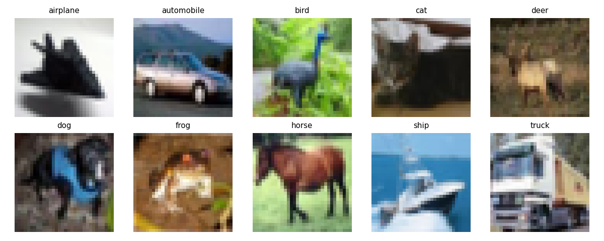

# CNN-Project: CIFAR-10 Classification

## Overview

- This project explores various neural network architectures on the CIFAR-10 dataset, comparing performance from simple fully connected models to deep convolutional networks.

## Project Structure
```
CNN-project/
├── data/                  # CIFAR-10 dataset and outputs
│   └── outputs/           # Important results folder
├── src/
│   ├── models/            # CNN and baseline models
│   │   ├── flat.py
│   │   ├── tiny_cnn.py
│   │   ├── wide_cnn.py
│   │   ├── deep_cnn.py
│   │   └── ...
│   ├── dataloader.py      # Data loading and augmentation
│   ├── train_utils.py     # Training and evaluation functions
│   └── inspect_data.py    # Visualize sample CIFAR-10 images
├── logs/
│   └── log.txt            # Training results
├── .gitignore             # Ignored files/folders
└── README.md              # Project documentation
```
## Data

- Dataset: CIFAR-10: 60,000 32x32 color images in 10 classes (50,000 train / 10,000 test).
- A sample of the dataset can be visualized with inspect_data.py, which generates a grid of one example per class:
  

## Models

- FlatNet
  - Fully connected network (32×32×3 → 10 outputs)
  - Serves as a baseline.

- Tiny CNN
  - 2 convolutional layers, small channel width.
  - MaxPool after each conv layer.

- Wide CNN
  - Similar to Tiny CNN but with wider channels (32 → 64).

- Deep CNN
  - 3 convolutional layers, deeper than Tiny/Wide CNN.

- Deep 4-Block CNN
  - 4 convolutional blocks, deeper architecture.
     
- Deep 5-Block CNN
  - 5 convolutional blocks, largest tested network.
    
## Training

- Loss: CrossEntropyLoss
- Optimizer: Adam, learning rate = 0.001
- Scheduler: CosineAnnealingLR (per epoch)
- Batch size: 128
- Device: CUDA if available

## Training Function:
- All models use the same run_one_epoch() function for training and evaluation, with proper handling for GPU and gradient updates.

## Results:
```
| Model       | Epochs | Data Aug | Scheduler | Best Validation Accuracy |
| ----------- | ------ | -------- | --------- | ------------------------ |
| FlatNet     | 3      | ❌        | ❌         | 0.377                 |
| FlatNet     | 10     | ❌        | ❌         | 0.392                 |
| Tiny CNN    | 3      | ❌        | ❌         | 0.581                 |
| Tiny CNN    | 10     | ❌        | ❌         | 0.647                 |
| Tiny CNN    | 10     | ✅        | ❌         | 0.641                 |
| Tiny CNN    | 30     | ✅        | ✅         | 0.688                 |
| Wide CNN    | 30     | ✅        | ✅         | 0.728                 |
| Deep CNN    | 30     | ✅        | ✅         | 0.784                 |
| 4-block CNN | 30     | ✅        | ✅         | 0.815                 |
| 5-block CNN | 30     | ✅        | ✅         | 0.829                 |
```
## Observations:

- CNN architectures outperform fully connected networks by a large margin.
- Increasing depth and width improves accuracy, but gains diminish beyond 4–5 convolutional blocks.
- Data augmentation and scheduler improve final validation accuracy.

  
